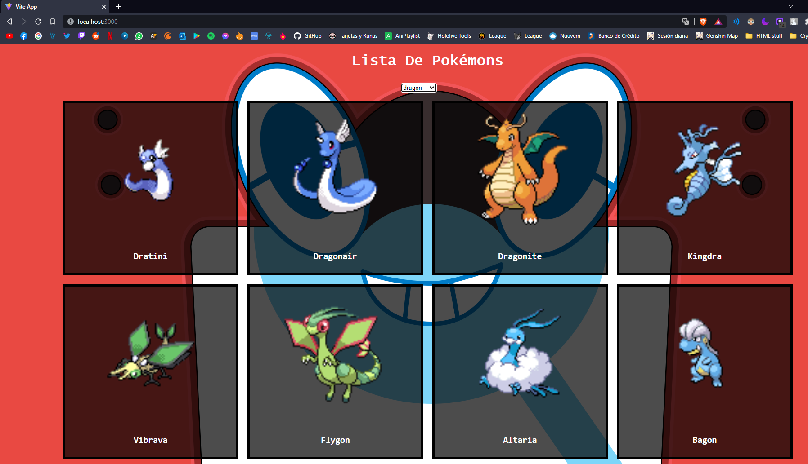

# Screenshot


### Installation

clone the repo

```
git clone https://github.com/ArielXT/ReactPokemonApi.git
```

move to the folder

```
cd ReactPokemonApi
```

install dependencies:

```
npm install
```

execute the project

```
npm run dev
```
